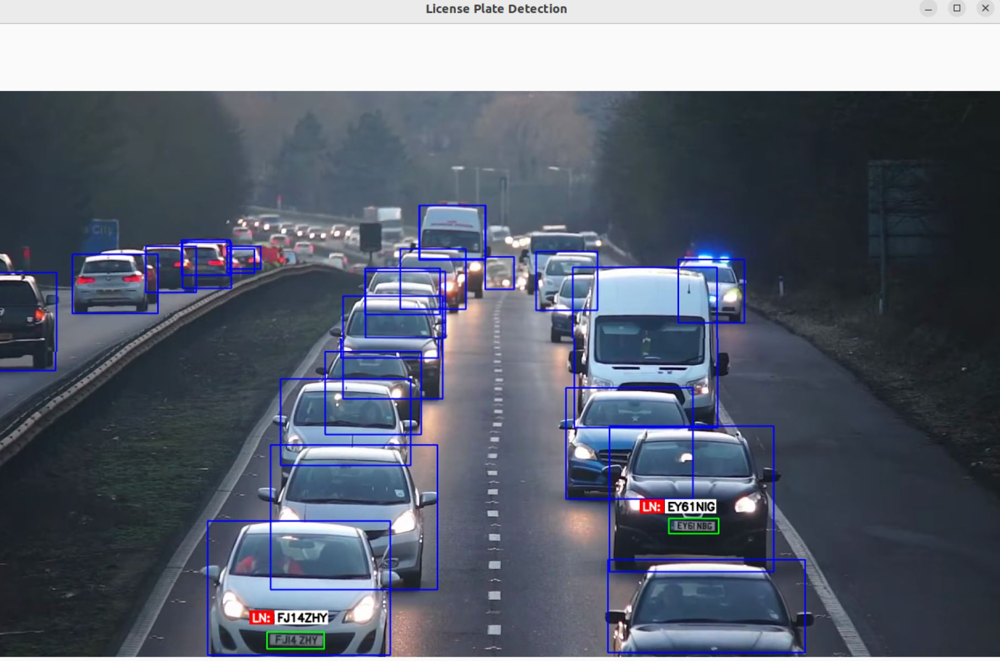

# # 🚗 License Plate Detection & Tracking with YOLOv8 + OCR

This project performs real-time **vehicle and license plate detection** using a **custom-trained YOLOv8 model**, tracks them using **SORT**, extracts license plate text using **EasyOCR**, and outputs **annotated videos** with **CSV logs**.

---

## 📽️ Demo

<p align="center">
  
</p>

---

## 🔧 Features

- ✅ Custom YOLOv8 license plate detector  
- ✅ Vehicle detection using pretrained YOLOv8  
- ✅ SORT tracking with unique ID per vehicle  
- ✅ OCR on detected license plates  
- ✅ Bounding box interpolation using SciPy (optional)  
- ✅ Annotated video output with auto-incremented filenames  
- ✅ CSV export with ID, frame number, timestamp, and plate number  

---

## 🧠 Tech Stack

| Component    | Tool/Library         |
|--------------|----------------------|
| Object Detection | YOLOv8 (Ultralytics) |
| Tracking     | SORT (Kalman + IOU Tracker) |
| OCR          | EasyOCR              |
| Video I/O    | OpenCV               |
| Scripting    | Python               |
| Interpolation| SciPy (for smoothing) |

---

## 🗂️ Project Structure

```bash
📂 license-plate-detector/
├── anpr_retrian_yolo.pt       # Your trained YOLOv8 plate model
├── main_final.py                        # Main entry script
├── sort/
│   ├── sort.py                          # SORT tracking module
├── utils.py
├── input/                               # Input video files
├── output/                              # Annotated output videos
├── recognized_plates.csv                # CSV log of detections
└── README.md
```
## Results:


